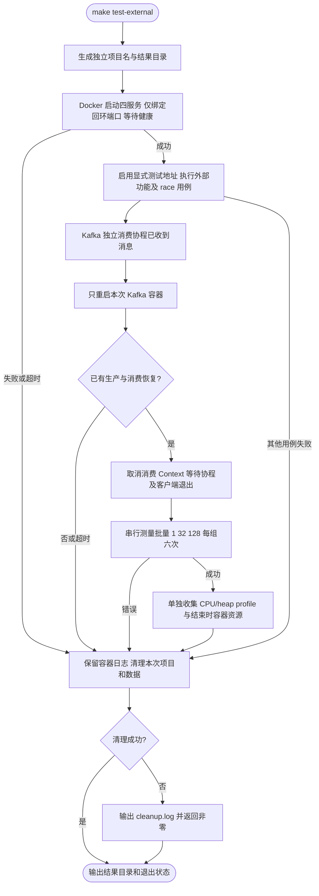

# 本地外部服务验证

在仓库根目录执行 `make test-external`。需要 Docker Engine、Docker Compose v2、根 go.mod 对应的 Go 工具链；首次可能下载 compose.yaml 中的固定版本镜像。不需要现有数据库、云凭据或额外 Go 依赖。

脚本创建带时间和 PID 的独立 `foundation-validation-*` 项目，只绑定本机端口：MySQL 13306、Redis 16379、Kafka 19092、Consul 18500。若端口已占用，启动失败并清理本次项目，不尝试停止占用端口的服务。不要同时运行多个实例。

MySQL 的固定密码仅是本地临时测试 fixture，不得用于生产。所有测试地址由脚本明确设置，不读取已有服务配置。Kafka topic/group、MySQL 表、Consul 前缀均使用独立名称；Kafka 测试数据随本次容器删除，MySQL 表与 Consul 前缀也在用例结束时清理。脚本在成功、失败和可捕获的中断后执行当前项目的 `down --volumes --remove-orphans`，不删除镜像、不操作其他项目。进程被强制 kill 或 Docker daemon 故障时仍可能残留本次项目，可根据输出的项目名手工清理。

可通过 `FOUNDATION_TEST_OUTPUT=/absolute/output/path make test-external` 保存报告；默认生成临时目录。普通 `make test`、`make verify` 不启动 Docker，未设置 `FOUNDATION_TEST_*` 地址时跳过外部用例。仅当使用该隔离脚本时设置 Docker 项目变量，Broker 重启测试只接受 `foundation-validation-` 前缀。

## 检查范围

| 检查 | 实际验证 | 边界 |
| --- | --- | --- |
| Kafka | 公共 Producer/Consumer，未提交批次重放，已有客户端跨 Broker 重启恢复，活动消费者取消停机 | 单 Broker、单副本，不验证多节点故障或跨机网络分区 |
| Kafka 批量 | 1/32/128，单分区，1KiB 固定种子伪随机内容，预先填充积压，真实同步提交 | Handler 无业务 I/O，不能直接替业务选择最优参数；不修改默认值 |
| MySQL | 使用 Foundation 驱动真实建连，事务回滚、50ms 截止时间取消慢查询，连接池随后可用 | 不覆盖业务 schema、复杂 SQL、数据库主从切换 |
| Redis | 两客户端互斥、跨原始 TTL 续租与释放；10 次测试连接 kill/重连/关闭后池为空 | 不是 Redis 节点故障、主从切换或网络分区测试 |
| Consul | 公共配置源与 Manager，热更新、删除高优先级值后恢复低优先级值，取消 blocking query 停机 | 单开发节点，无 ACL/TLS 或多节点一致性故障 |
| 资源 | 20 次 Kafka 客户端创建/ping/关闭后的 goroutine/GC 堆快照；CPU/分配剖析；容器运行结束时资源快照 | 短样本可识别明显累积，不能证明长期无泄漏，容器快照不是峰值 |

OSS、Cron 队列上限、WebSocket 超限与压缩池的并发/释放检查仍由已有确定性测试及竞态测试覆盖。真实云 OSS 的 IAM、服务端限流、网络延迟和签名行为不能用 MySQL/Redis 或 MinIO 替代；需要对应测试 bucket 和云侧观测。当前没有所需云端环境，不能声称已经验证。

## 产物与解释

- `functional.txt`：真实功能、Broker 重启恢复、取消停机和资源循环结果，带 `-race`。
- `kafka-batch.txt`：不带 race/pprof 的六次批量测量；包含 records/s、实际 records/batch、同步 CommitRecords p95/p99、B/op 与 allocs/op。首次入组及预热不计时；新 Topic 的默认分区数由 compose 固定为 1。
- `cpu.pprof`、`heap.pprof`、`cpu-top.txt`、`alloc-top.txt`：独立一次批量 128 的剖析，包含客户端组装、数据填充和关闭，不能将全部采样直接解释为稳定消费路径。
- `services.txt`、`toolchain.txt`、`container-stats.jsonl`、`services.log`、`cleanup.log`：测试版本、实例状态、结束时资源快照和清理记录。

比较业务负载时，保持同一机器、消息内容、分区数、业务 Handler 和服务配置，串行运行；先比较批量，再比较并发，避免同时改变多个变量。进一步的业务压测需要实际 Handler，观察端到端 p95/p99、持续 lag、重平衡与重放范围。本地空 Handler 的吞吐不等于生产容量。
